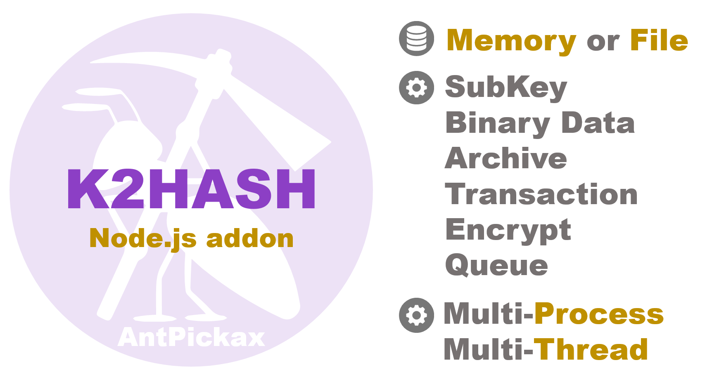

# **K2HASH Node.js**
**K2HASH Node.js**（addon library for Node.js）は、いくつかの特徴を備えた独自の **KVS**（key-value store）ライブラリ **K2HASH**（NoSQL Key Value Store(KVS) library）のNode.jsアドオンライブラリです。  
**K2HASH Node.js** を利用して、**K2HASH**ライブラリが提供するすべての機能をサーバーサイドJavaScript環境の [Node.js](https://nodejs.org/ja/)で利用できます。  
**K2HASH Node.js** は、Yahoo! JAPANがオープンソースとして公開するプロダクト [AntPickax](https://antpick.ax/indexja.html) のひとつです。  

## {{ page.arrow_link_overview }}
**K2HASH Node.js** の[概要](homeja.html)について説明します。  

## {{ page.arrow_link_feature }}
**K2HASH Node.js** の[特徴](featureja.html)について詳しく説明します。  

## {{ page.arrow_link_usage }}
**K2HASH Node.js** をプログラムに組み込むための[使い方](usageja.html)について説明します。  

## {{ page.arrow_link_build }}
**K2HASH Node.js** をGithubの[ソースコード]({{ site.github.repository_url }})から[ビルド](buildja.html)する方法を説明します。

## {{ page.arrow_link_developer }}
**K2HASH Node.js** が提供する[開発者](developerja.html)向けのプログラミングインターフェースを説明します。

## {{ page.arrow_link_environments }}
**K2HASH Node.js** がロードする[環境変数](environmentsja.html)について説明します。

# **K2HASHについて**
[K2HASH](https://k2hash.antpick.ax/indexja.html)は、Yahoo! JAPANがオープンソースとして公開するNoSQL Key Value Store(KVS) libraryです。  
詳細は、[K2HASH](https://k2hash.antpick.ax/indexja.html) を参照してください。

# **AntPickaxについて**
[AntPickax](https://antpick.ax/indexja.html)は、Yahoo! JAPANがオープンソースとして公開する一連のプロダクト群です。  
詳細は、[AntPickax](https://antpick.ax/indexja.html) を参照してください。
